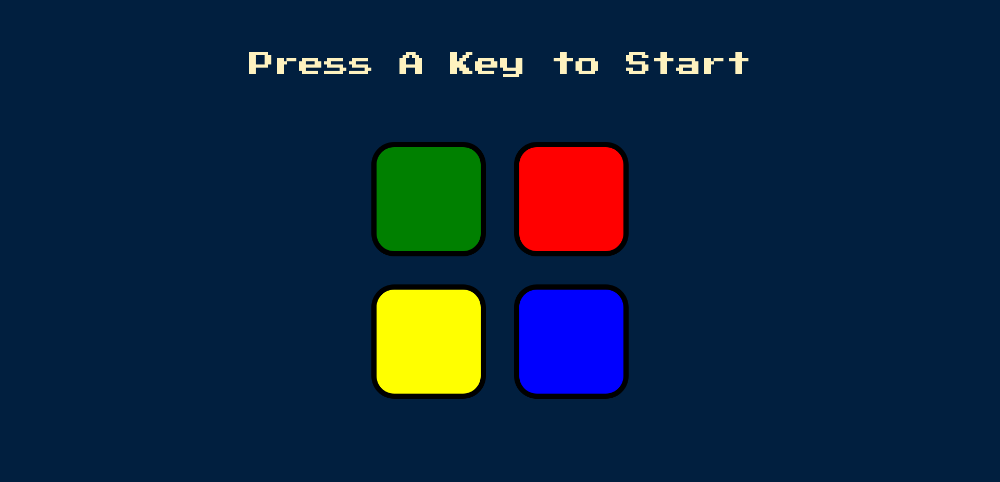

# Simon Game Challenge

A fun and interactive memory game built with **HTML**, **CSS**, and **jQuery**.  
Repeat the pattern of flashes and sounds to level up. If you make a mistake, the game resets!

## Table of contents

- [Overview](#overview) 
- [Screenshot](#screenshot)
- [Live Demo](#links)
- [My process](#my-process) 
- [Built with](#built-with) 
- [What I learned](#what-i-learned) 
- [Continued development](#continued-development) 
- [Useful resources](#useful-resources) 
- [Author](#author)
- [Acknowledgments](#acknowledgments)

## Overview

The **Simon Game** is a simple memory-based color sequence game. A new color is added each level, and the player must repeat the entire sequence correctly. It's a great project to practice **event handling**, **animations**, **timing**, and **logic** using **jQuery**.

### Screenshot

### Live Demo

- Check out the live game 👉: [Add live site URL here](https://your-live-site-url.com)

## My process

1. Setup basic HTML layout with 4 colored buttons.
2. Styled using CSS for visual feedback (pressed).
3. Used **jQuery** for:
   - DOM manipulation
   - Click and keydown events
   - Playing sounds
   - Managing game logic and sequences
4. Added game reset and level tracking.

### Built with
- HTML5  
- CSS3  
- jQuery  
- Sound effects (MP3 files)

### What I learned
- Handling user input using `keydown()` and `click()` events in jQuery
- How to use arrays to track game and user patterns
- Managing game states (start, in-progress, game over)
- Creating interactive UI animations using `.addClass()` and `.removeClass()`

### Continued development

In future versions, I’d like to:
- Add touch support for mobile
- Track and display high scores using `localStorage`
- Add difficulty levels or speed changes
- Improve visual feedback with animations

### Useful resources

- [jQuery Documentation](https://api.jquery.com/)  
- [MDN Web Docs - JavaScript](https://developer.mozilla.org/en-US/docs/Web/JavaScript)  
- [W3Schools - jQuery](https://www.w3schools.com/jquery/)

## Author

Made with ❤️ by **[Jaya V]**  
- GitHub: [@Jayajo5](https://github.com/Jayajo5) 
- LinkedIn: [Your LinkedIn](#)

## Acknowledgments

- Inspired by the original **Simon®** game.
- Thanks to Angela Yu’s Web Development Bootcamp for the project idea.  
- Sound files sourced from free audio resources.

